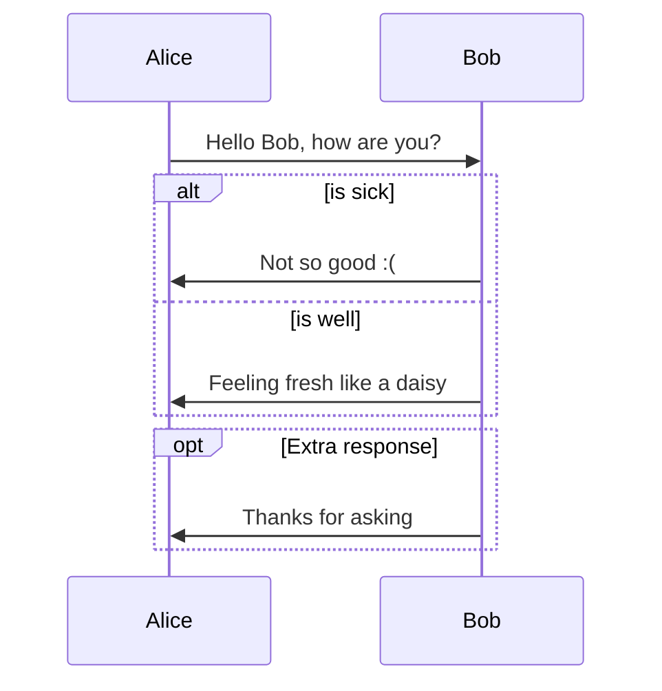
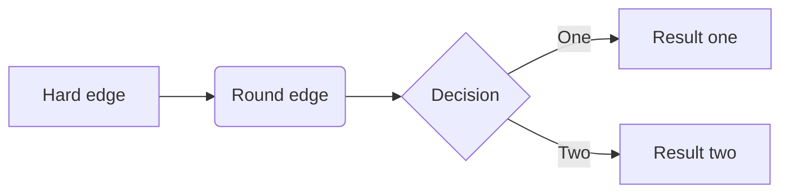

# VAEs for anomaly detection

@startmermaid
pie title Pets adopted by volunteers
  "Dogs" : 386
  "Cats" : 85
  "Rats" : 35
@endmermaid

<!DOCTYPE html>
<html lang="en">
   <head>
	 
    </head>
	 
<body>
 <pre><code class="language-mermaid">graph LR
A--&gt;B
</code></pre>

graph LR
A--&gt;B

	
</body>

</html>
