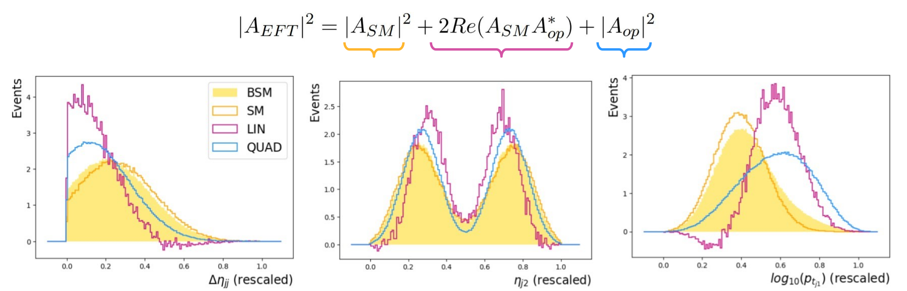

## Vector Boson Scattering (VBS)
VBS takes place when quarks from different protons radiate vector bosons, which in turn interact.
It is an ideal place for searches for new physics because it is **sensitive to modifications of the EWK sector**.
### Same Sign WW scattering:
We used MC generations @LO, @parton-level of SSWW scattering with fully leptonic final state:

## SM Effective Field Theories (SMEFT)
The SM is seen as a **low energy approximation of an unknown theory** and BSM effects are parametrized as additional terms to the SM lagrangian through operators of order larger than four:

This stuy is focused on 15 dim 6 operators chosen from the Warsaw Basis
### detecting EFT contributions as anomalies:
The EFT operators modify the distributions of the variables, that now comprise:
- A pure SM contribution
- Additional terms with linear and quadratic dependence on the EFT operator considered
  

## Variational AutoEncoders for anomaly detection
lalalal
blabla

blaaaaa

## Optimizing for discrimination: VAE + DNN

