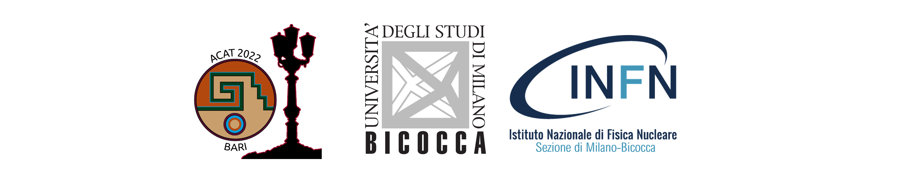 
Giacomo Boldrini1,2, Simone Gennai1,2, Pietro Govoni1,2, **Giulia Lavizzari** *1,2

1 - Milano Bicocca University, Piazza della Scienza 3, 20126 Milano, Italy  
2 - INFN Milano - Bicocca, Piazza della Scienza 3, 20126 Milano, Italy  
*g.lavizzari1@campus.unimib.it

 
VBS takes place when quarks from different protons radiate vector bosons, which in turn interact:
- It is an ideal place for searches for new physics because it is **sensitive to modifications of the electroweak (EW) sector**.
- At Leading Order (LO) it is a purely EW process
- We used MC generations @LO, @parton-level of **Same Sign WW scattering(SSWW)** with fully leptonic final state:

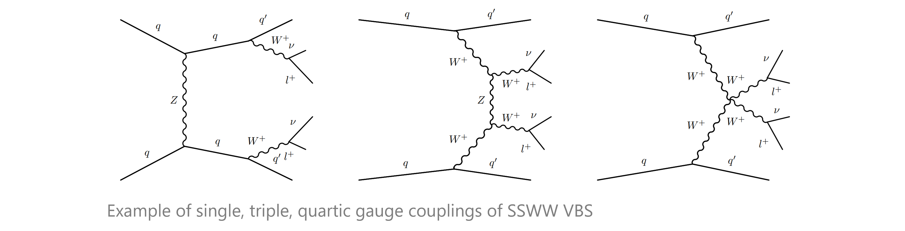
    
 
The SM is seen as a **low energy approximation of an unknown theory** and BSM effects are parametrized as additional terms to the SM lagrangian through operators of order larger than four:

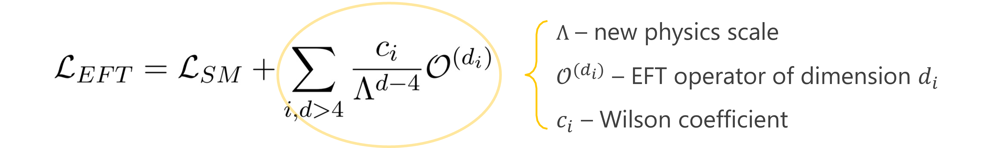

This stuy is focused on 15 dim 6 operators chosen from the Warsaw Basis, which modify the decay amplitudes (and therefore the distributions of the variables) as follows:
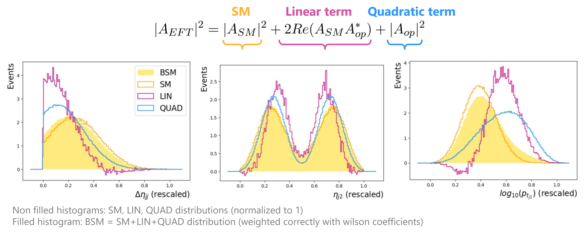

    
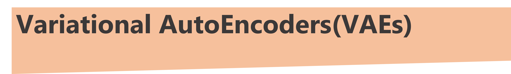 
**VAEs are trained to reconstruct an input**: the input is mapped as a distribution in the latent space, from which a point is sampled and decoded.  
The model is trained minimizing two loss functions:
- **Kullback-Leibler divergence** (KLD) - regularization of the latent space
- **Mean Squared Error** (MSE) - reconstruction of the input

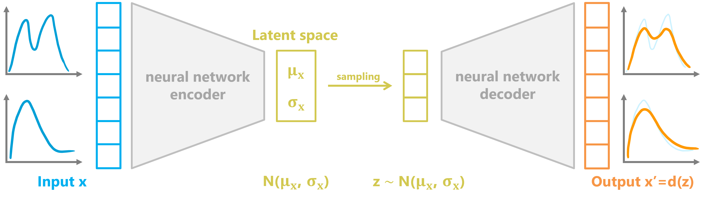

## Anomaly detection:
The VAE model is **trained to reconstruct a sample that comprises SM events**. When it is fed anomalous data (EFT events), those are badly reconstructed and can be singled out:
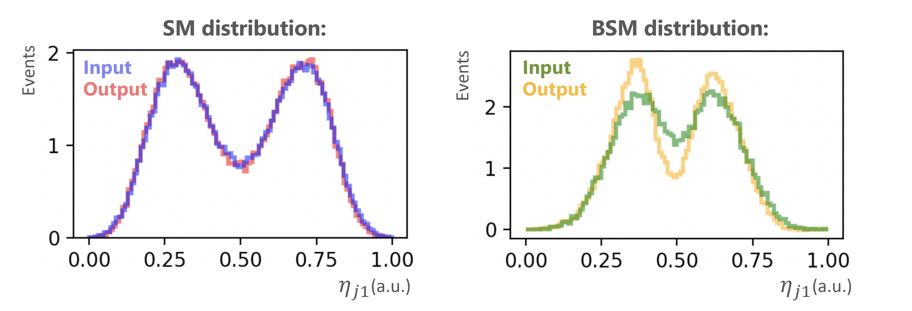

Therefore, **anomalies are expected to lie in the tail of the loss function**:
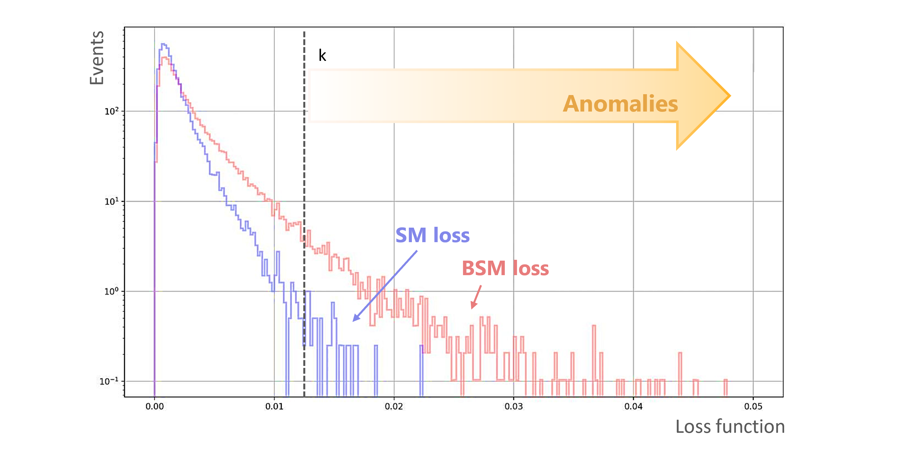
    
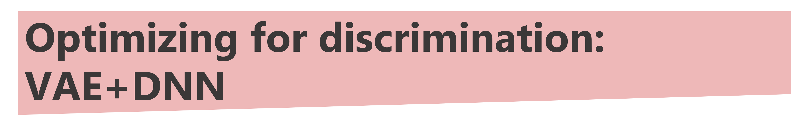 
## Simple VAE
- built via subclassing on TensorFlow and Keras libraries
- deeply connected NN layers
- optimizer: Adam
- Epochs: up to 200 (convergence $\simeq$ 100)
- Batch size: 32/64
- Different dimensions of the latent space
  
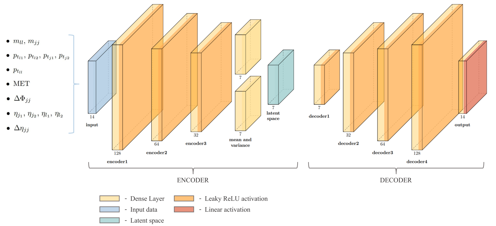

## VAE + DNN binary classifier
Even though the ultimate aim is isolating EFT contributions, **the VAE model is solely trained to recontruct a SM sample**. However, the choices that improve SM reconstruction are not always optimal for discrimination (e.g. dimension of the latent space).  
Therefore, we built a model that optimizes both reconstruction and discrimination during training:
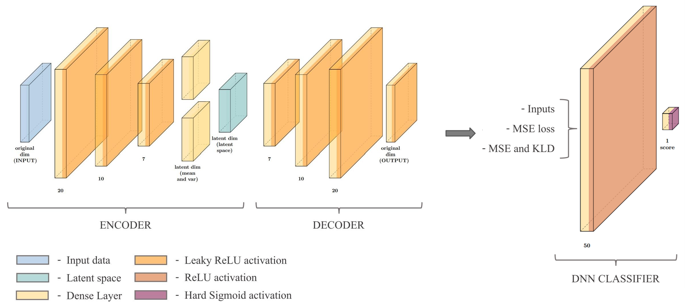  
- the **VAE** part is trained to reconstruct **a pure SM sample**
- the **classifier** is trained to discriminate between **SM and EFT contributions from a single operator**, based on the VAE output
- Losses: MSE, KLD, **binary cross entropy** (for classification)
  
The outputs we obtained are the following:
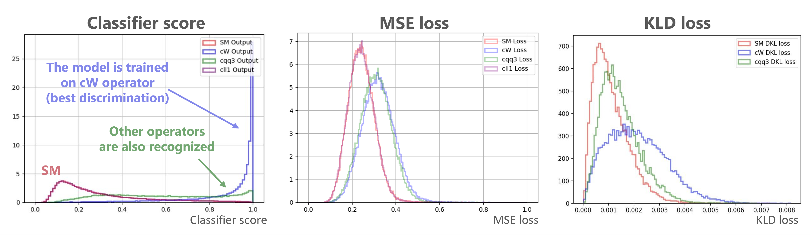 
    

To assess whether a model is able to discriminate between SM and BSM events we defind the significance as:
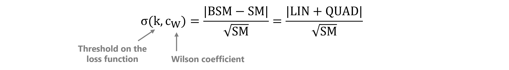
  
Here we show the results for sigmamax:
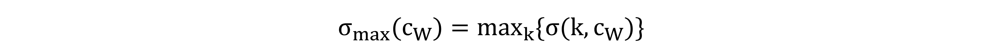
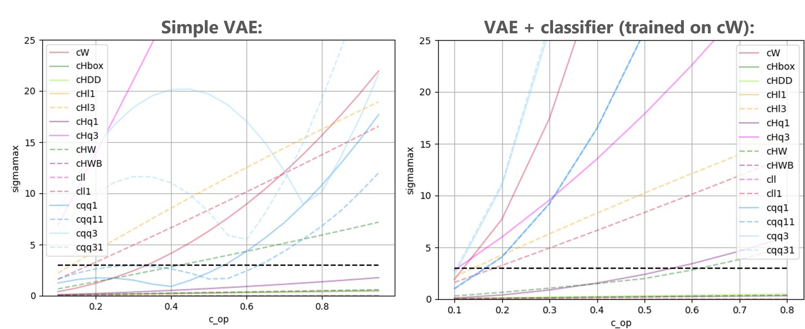 
  
We call a model sensitive to an operator if the significance reaches at least 3:
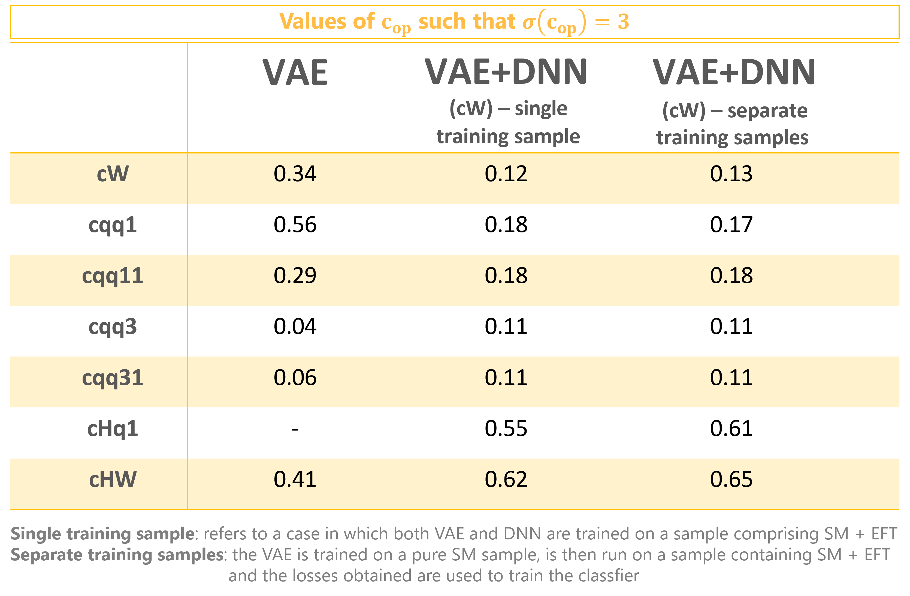 
The performances of the VAE+DNN model are overall better than those obtained with the simple VAE. The greatest gain in sensitivity is achieved for the operator on which the model was trained (cW in the example), but an improvement is seen also for other operators (to the point of gaining sensitivity on operators that could not be singled out with the simple VAE e.g. cHq1).  
