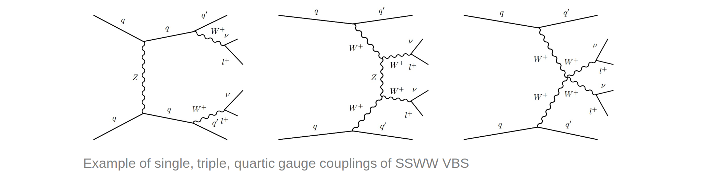
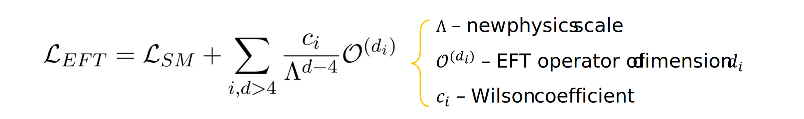

 
VBS takes place when quarks from different protons radiate vector bosons, which in turn interact:
- It is an ideal place for searches for new physics because it is **sensitive to modifications of the EWK sector**.
- We used MC generations @LO, @parton-level of **Same Sign WW scattering(SSWW)** with fully leptonic final state:

    
 
The SM is seen as a **low energy approximation of an unknown theory** and BSM effects are parametrized as additional terms to the SM lagrangian through operators of order larger than four:

This stuy is focused on 15 dim 6 operators chosen from the Warsaw Basis, which modify the distributions of the variables as follows:

    
 
**VAEs are trained to reconstruct an input**: the input is mapped as a distribution in the latent space, from which a point is sampled an decoded.  
The model is trained minimizing two loss functions:
- **Kullback-Leibler divergence** (KLD) - regularization of the latent space
- **Mean Squared Error** (MSE) - reconstruction of the input

## Anomaly detection:
The VAE model is **trained to reconstruct a sample that comprises SM events**. When it is fed anomalous data (EFT events), those are badly reconstructed and can be singled out:

Therefore, **anomalies are expected to lie in the tail of the loss function**:

    
 
Even though the ultimate aim is isolating EFT contributions, **the VAE model is solely trained to recontruct a SM sample**. However, the choices that improve SM reconstruction are not always optimal for discrimination (e.g. dimension of the latent space)

## A new model: VAE + DNN classifier
We built a model that optimizes both reconstruction and discrimination during training:
  
The model is trained on **a pure SM sample** and on **EFT contributions from a single operator**, by minimizing the following losses:
- KLD (regularization)
- MSE (reconstruction)
- **Binary cross-entropy** (discrimination)

## Results:
- SM events are still reconstructed better than EFT events 
- The discrimination is best for the operator the model was trained on
- Some operators do not allow for discrimination (the shape of the distributions are similar to that of the SM)
     
 
    
 
 
 

